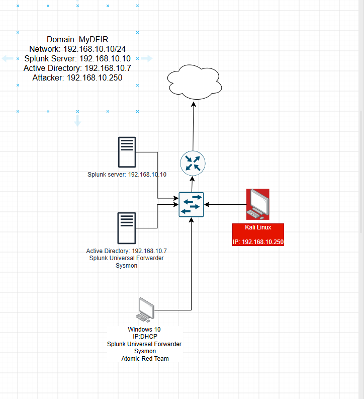
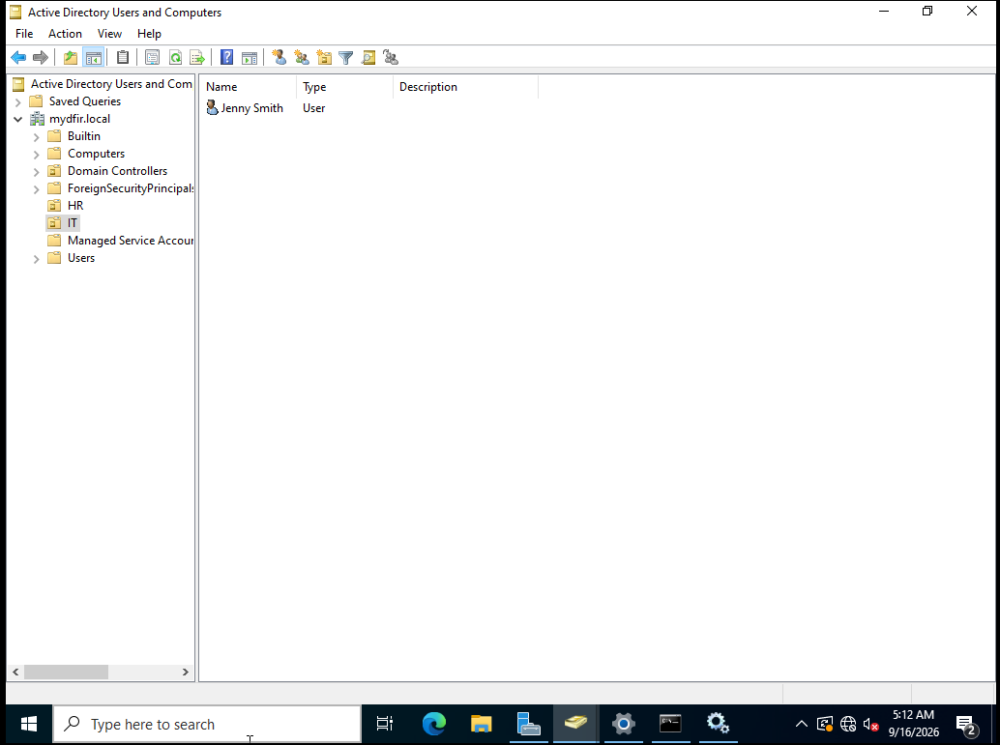
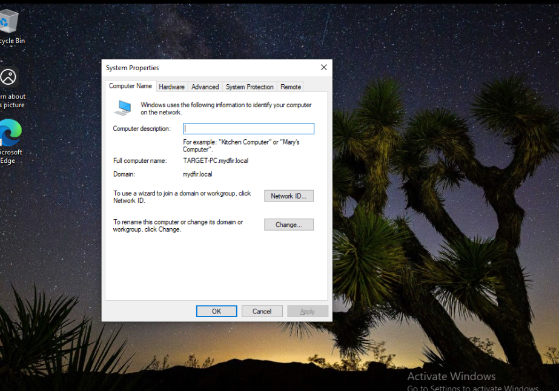
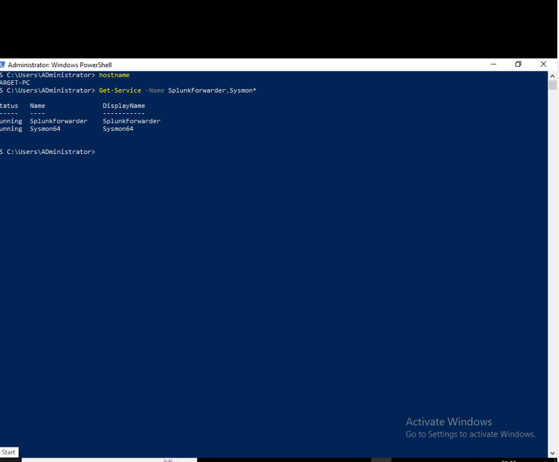

# Active Directory Security Monitoring Lab

## Overview

## Design Overview

I designed an isolated Active Directory security lab using VMware. All virtual machines were connected to the private `192.168.10.0/24` network so they could communicate within a controlled environment.

The lab consisted of:

- `ADDC01` (`192.168.10.7`) – Windows Server 2022 domain controller for `mydfir.local`.
- `TARGET-PC` (`192.168.10.100`) – Windows 10 endpoint joined to the domain.
- Splunk Server (`192.168.10.10`) – Collected and indexed security events.
- Kali Linux (`192.168.10.250`) – Used to generate authorised security-testing activity.

## Event Flow

Sysmon and Windows Event Logs generated telemetry on the Windows endpoint. The Splunk Universal Forwarder sent these logs to the Splunk server, where I searched and investigated the activity.

Kali Linux was used to simulate activity against the Windows target. This allowed me to observe how authentication attempts and other endpoint activity appeared in Splunk.

## Purpose of the Design

The environment allowed me to practise:

- Active Directory administration
- Windows domain authentication
- Endpoint log collection
- Security event monitoring with Splunk
- Controlled attack simulation
- Investigating security telemetry

This repository documents my completion of the MyDFIR Active Directory Project 1.0.

The project involves building an Active Directory home lab using Windows Server, a Windows target machine, Splunk, Sysmon, Kali Linux and Atomic Red Team.

The goal is to collect Windows security events, generate authorised test activity and investigate the resulting logs using Splunk.

## Project Status

✅ Completed

## Lab Architecture

The diagram below shows the planned architecture of the Active Directory security monitoring lab. All virtual machines are connected through the private `192.168.10.0/24` network.

## Project Documentation

- [Part 1: Lab Design and Architecture](docs/01-lab-design.md)
  
### Lab Systems

| System | Hostname | IP Address | Purpose |
|---|---|---:|---|
| Ubuntu Server | Splunk Server | 192.168.10.10 | Receives, indexes and displays security events |
| Windows Server 2022 | ADDC01 | 192.168.10.7 | Domain controller for `mydfir.local` |
| Windows 10 | TARGET-PC | 192.168.10.100 | Domain-joined endpoint monitored using Sysmon and Splunk Universal Forwarder |
| Kali Linux | kali | 192.168.10.250 | Authorised security-testing machine |

## Active Directory Configuration

I configured ADDC01 as the domain controller for `mydfir.local`. I created IT and HR organisational units and added Jenny Smith (`jsmith`) and Terry Smith (`tsmith`) as domain users.

### Organising Domain Users

Jenny Smith's account is located in the IT organisational unit.

### Joining the Windows Endpoint

I joined TARGET-PC to `mydfir.local`. The screenshot confirms its full computer name and domain membership.

## Endpoint Monitoring

I installed Sysmon and Splunk Universal Forwarder on TARGET-PC to support centralised monitoring.

- Sysmon records detailed endpoint activity in Windows Event Logs.
- Splunk Universal Forwarder collects the configured logs and forwards them to the Splunk server at `192.168.10.10`.

I checked the hostname and service statuses using PowerShell:

    hostname
    Get-Service -Name SplunkForwarder,Sysmon*

Both SplunkForwarder and Sysmon64 were running on TARGET-PC.

This check confirms that the services are running. Log delivery is verified separately through searches in Splunk.
